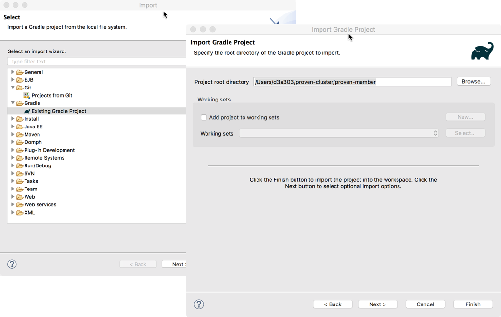
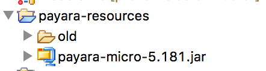
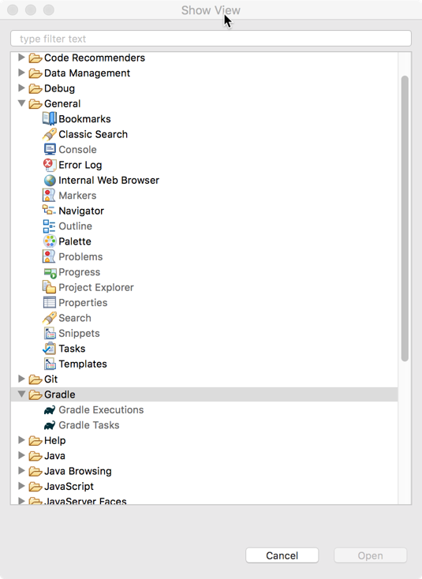
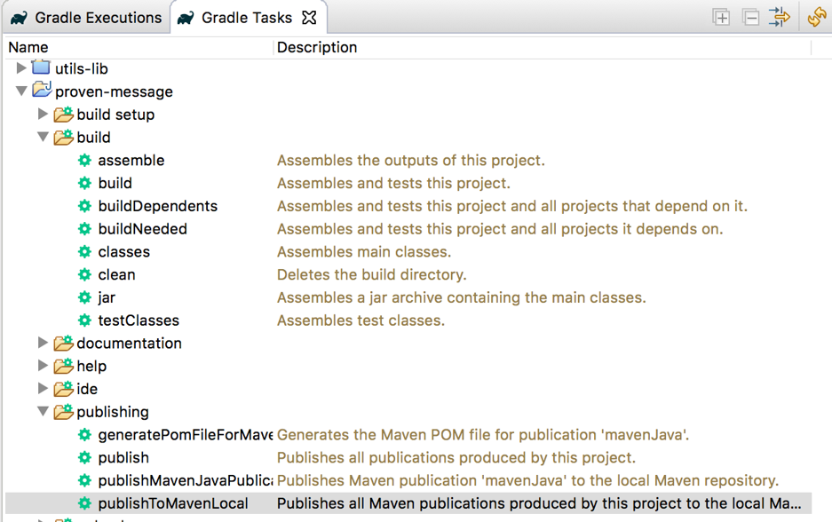
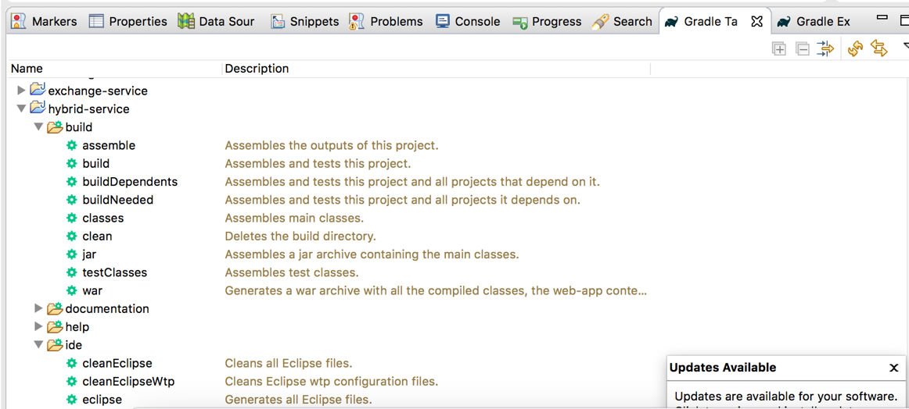
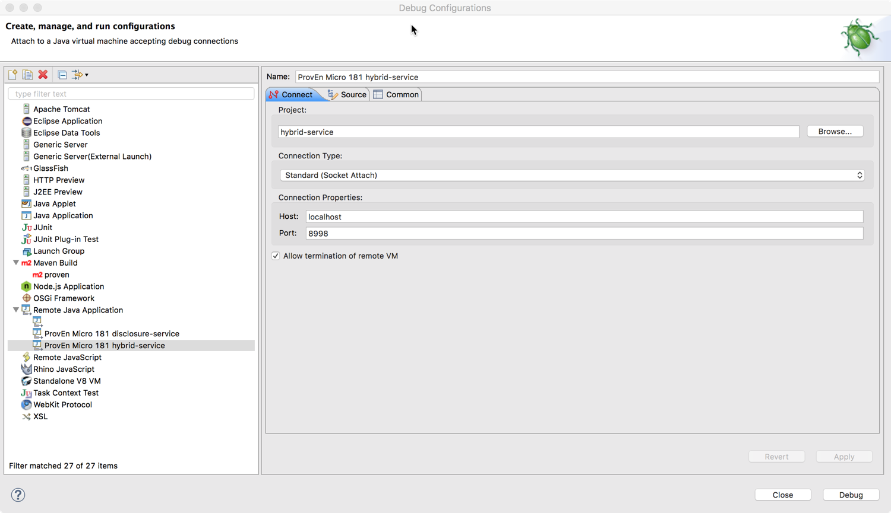
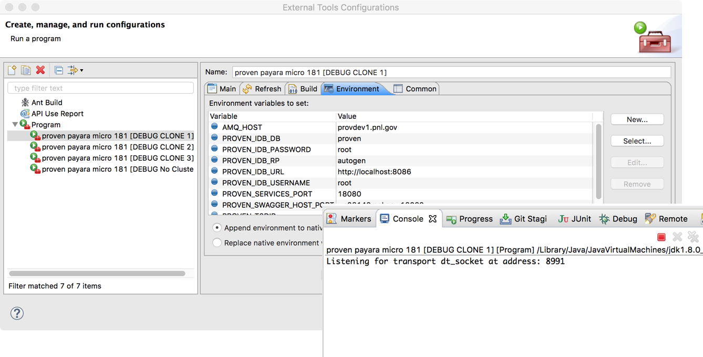
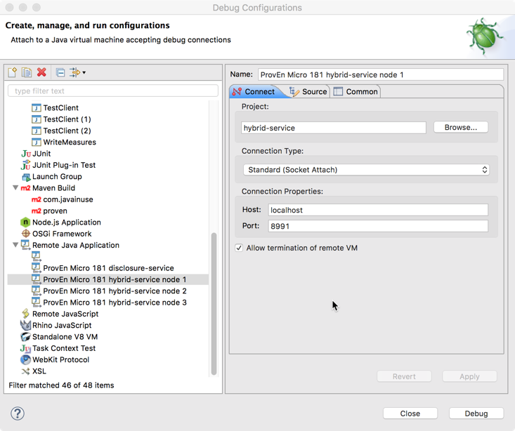
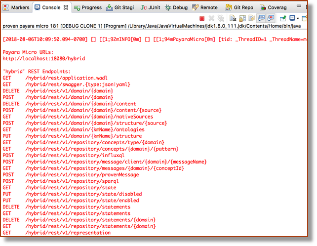
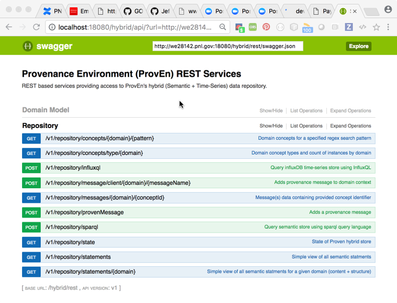

Purpose
-------
* Setting up a development and testbed environment is not trivial.  This slide deck documents the testbed I set up on my MacOS laptop. Hopefully this will be helpful to the wider GridAPPS-D team or other development teams using ProvEn.
* Disclaimer:  This guide is intended to offer a complete set of notes.   However there may be differences depending on the platform you are using and unfortunately there may some gaps of knowledge.

What you should expect to do
----------------------------
Once the development system and testbed are completely setup you should be able to run a ProvEn server in debug mode, accessible by REST services

Prerequisites
-------------

* Download and install
	* Latest Eclipse IDE J2EE (I used Eclipse Oxygen.2 (4.7.2))	
	* Java 8 JDK
	
* Brew install
	* git 2.12.0
	* gradle 4.5.1
	* influxdb 1.4.2
	* maven 3.3.3 3.3.9
* Download and set aside for later use
	* payara-micro-5.181.jar from: https://s3-eu-west-1.amazonaws.com/payara.fish/Payara+Downloads/
* Please note that Eclipse will need to be configured to support your Gradle, Maven, use your Java 8 JDK

Clone Proven Repositories
-------------------------

* https://github.com/pnnl/proven-message
* https://github.com/pnnl/proven-cluster
* https://github.com/pnnl/proven-client
* https://github.com/pnnl/proven-docker

Import Gradle Projects in Eclipse
---------------------------------

* Import proven-message and proven-member projects as gradle projects.
	* Note:  The “proven-cluster” project contains several nested layers of projects.  
	* Import the “proven-cluster” subproject “proven-member”  – importing “proven-cluster will cause undesirable effects, limiting what you can build. 
		

	
Create General Eclipse Project for testbed Resources
----------------------------------------------------
This project(name it "payara-resources") will be used to provide a micro service engine for testing later. Add the payara-micro jar in the top folder

   
..

Build and publish proven_message jar
-------------------------------------

* Open the following Eclipse views using Window->show view
	* General->Console
	* Gradle->Gradle Executions
	* Gradle->Gradle Tasks
* Click on the proven_message project (you may need to click on the build.gradle file).

    
..

Build and publish proven_message-0.1-all-in-one jar
----------------------------------------------------

Build and publish the proven_message-0.1-all-in-one.jar file to maven local repository so that the hybrid services can use the interface.
* Open build task folder
* Double click on “build” task.
* Open publishing task folder.
* Double click on “publish” task.
* Double click on “publishToMavenLocal”
* Confirm no errors in Console View.
* Inspect the proven-message/build/libs/ directory for proven-message-0.1-all-in-one.jar

..

Building the ProvEn Server (proven-member)
------------------------------------------

* Use Gradle Tasks to Build the Proven hybrid service war file
* If necessary use Gradle IDE tasks to rebuild eclipse files.

Create External Tools Configurations 
------------------------------------

	
Create Debug Configuration
--------------------------

Running the Hybrid Service
--------------------------
* Steps to running server in debug mode:
	* Start InfluxDB
	* Run External Tools Configurations “proven payara micro 181 [DEBUG CLONE 1]”
	* Run debug  configuration “proven micro 181 hybrid-service node 1”
	* Startup can take several minutes

	

	
Correct startup should look something like this in the console

Swagger UI of Debug Interface
-----------------------------

