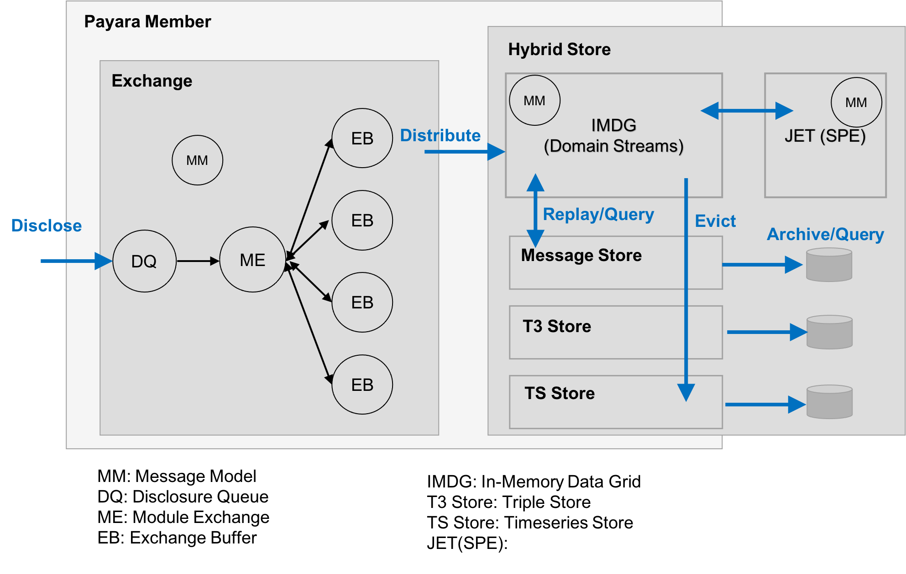

Proven consists of the following primary architectural elements:

1. Exchange - Data collection, preparation, and distribution to Hybrid Store’s streaming environment.    
2. Hybrid Store – Message streaming and cache, with archival (TS, T3, Object).  Messages are RDF sub-graphs.  Stream processing support.

Inside Proven Member
--------------------

Proven Exchange
---------------

* Data collection and preparation for distribution to Hybrid Store
* External - JSON and JSON-LD are currently the accepted formats
* Internal – JSON-LD (i.e. data represented as subgraphs internally)
* All disclosed content is verified for syntactic correctness.  Each content type has an associated JSON-SCHEMA to perform this verification; a 2-part process:
    1. Proven-message is verified (i.e. wrapper; the proven part)
    2. Message content is verified.  If content is JSON-LD then JSON-SCHEMA for JSON-LD is used to verify syntactic correctness.
* All disclosed content is transformed into a subgraph for semantic processing, as follows:
    1. Mime type is examined if JSON-LD then no further processing necessary
    2. For domain Knowledge content: A default JSON-LD context is provided in the outer object.  This simply includes a @vocab setting using the message’s domain value.
    3. For “Proven specific” content:  The pre-defined context for the message content type is injected.
    4. If the message’s outer object is an array, then the array is first encapsulated by an object before adding the context.
* All proven specific content types (including the wrapper) have an associated ontology and context definition.
* Message syntactic verification and semantic transforms are performed at point of entry and any issues are reported to Hybrid store’s Response stream.
* Exchange consists of 2 primary component types:
    * Exchange Buffer: Have unique responsibilities in terms of disclosure item processing
    * Module Exchange: Responsible for distributing a disclosed item to a “ready” ExchangeBuffer for processing (distribution can be at the module, member or cluster level)
* Following are the ExchangeBuffer types:
    * DisclosureBuffer: disclosure item distribution
    * ModuleServiceBuffer: services module requests. 
    * PipelineServiceBuffer: services pipeline requests.
    * ResponseBuffer:  distribution of response/results to domain resonse stream. 
    * ProvenanceBuffer: provenance generation and distribution
    * RulesBuffer: rule-based inference and distribution
* Provenance capture is accomplished using the afore mentioned message ontologies and SHACL rules to generate PROV provenance assertions.
* Rules are also defined using SHACL and content specific ontologies.
* Each domain has its own provenance and stream.
* Each buffer is applicable to any domain; processing is determined by a message’s semantic description or Message Model  (i.e. ontologies, context, rules, provenance, etc.)
* Disclsoure item paths are static and these paths are defined and used by a ModuleExchange. 
* ModuleExchange’s are informed of the candidate ExchangeBuffers via module reporting making their lookup performant.
* Back pressure is to the caller.
* Exchange items that cannot be processed due to an “unavailable” ModuleExchange, are transferred to a Suspend stream to avoid data loss.  These items are given highest priority once a ModuleExchange becomes available. 

Proven Hybrid Store
-------------------

